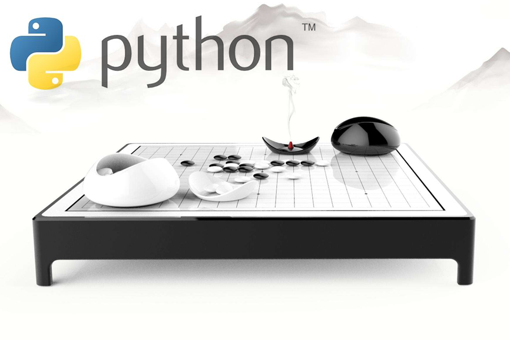

% Python 哲学

Python,哲学

---

#::Copyright

+ 作者 = xiaowang (xer345@126.com)
+ 日期 = 2017-04-07
+ 时间 = 2017-04-08 00:46:50 / 2017-04-20 16:58:37
+ 链接 = [Python 哲学](http://onlookee.com/?c=Article&a=view&id=6)
+ 版本 = 1.0
+ 关于 = [ONLOOKEE.COM](http://onlookee.com/) 一直在分享有价值的软件/应用 、Python经验。

#::文章信息

+ 类别 = Python
+ 平台 = Windows,Mac,Linux
+ 官网 = [Welcome to Python.org](https://www.python.org/ "")

#::截图照片

+ 

#::文章内容

-   [Python 的特性](#python-的特性)
-   [Python 特点](#python-特点)
-   [Python 格言](#python-格言)

大概几年前（2012 年），开始接触的 Python 这门编程语言

当前，世界上的编程语言不下百种，有一些是通用的，而有一些则是专门针对某一领域的。

Python 属于前者，是一门通用高级动态编程语言。

在众多语言中，我为何会选择 Python ？

Python 的特性
-------------

Python
的设计哲学是“优雅”、“明确”、“简单”，“用一种方法，最好是只有一种方法来做一件事”，对于一个特定的问题，只要有一种最好的方法来解决就好了。

Python
的作者有意的设计限制性很强的语法，使得不好的编程习惯都不能通过编译。其中很重要的一项就是
Python 的缩进规则。Python
在设计上坚持了清晰划一的风格，尽量写容易看明白的代码，尽量写少的代码。这使得
Python 的语法简洁、易读。

Python
是完全面向对象的语言。函数、模块、数字、字符串都是对象。并且完全支持继承、重载、派生、多继承，有益于增强源代码的复用性。Python
支持重载运算符和动态类型。

Python
本身被设计为可扩充的。并非所有的特性和功能都集成到语言核心。Python
提供了丰富的 API 和工具，以便程序员能够轻松地使用 C 语言、C++、Cython
来编写扩充模块。

Python 具有丰富和强大的库。它们的功能无所不包，覆盖科学计算、Web
开发、数据库接口、图形系统多个领域，并且大多成熟而稳定。借助于拥有基于标准库的大量工具、能够使用低级语言如
C 和可以作为其他库接口的 C++，Python
已成为一种强大的应用于其他语言与工具之间的胶水语言。

作为一门高级动态编程语言，你不需要事先进行变量声明，多数情况下你也不必太在意变量的类型。列表、元组、字典、集合等强大的数据类型，让你可以随心所欲的组织你的数据。列表表达式，则可以让你用非常简洁的语句完成循环数据处理。

这些优秀的特性可以极大的提高你开发的效率，当你在 JAVA
里思考变量的类型时，也许用 Python 已经完成了程序的基本架构。当你在 JAVA
里因参数的不确定性而不知所措时，你会发现对于 Python 是如此的自然。当你在
JAVA 里为程序返回值的多太性而苦恼时，你会发现对于 Python
是如此遐意。当你用 Python 完成了基本开发时，也许使用 JAVA 才刚刚起步。

Python 是一门可以快速地将你的灵感变成现实的语言。

Python 特点
-----------

1.  易于学习：Python
    有相对较少的关键字，结构简单，和一个明确定义的语法，学习起来更加简单。
2.  易于阅读：Python 代码定义的更清晰。
3.  易于维护：Python 的成功在于它的源代码是相当容易维护的。
4.  一个广泛的标准库：Python 的最大的优势之一是丰富的库，跨平台的，在
    UNIX，Windows 和 Macintosh 兼容很好。
5.  互动模式：互动模式的支持，您可以从终端输入执行代码并获得结果的语言，互动的测试和调试代码片断。
6.  可移植：基于其开放源代码的特性，Python
    已经被移植（也就是使其工作）到许多平台。
7.  可扩展：如果你需要一段运行很快的关键代码，或者是想要编写一些不愿开放的算法，你可以使用
    C 或 C++完成那部分程序，然后从你的 Python 程序中调用。
8.  数据库：Python 提供所有主要的商业数据库的接口。
9.  GUI 编程：Python 支持 GUI 可以创建和移植到许多系统调用。
10. 可嵌入: 你可以将 Python 嵌入到
    C/C++程序，让你的程序的用户获得“脚本化”的能力。

Python 格言
-----------

在任何一个 Python 交互解释器中输入“import this”命令，就会出现一篇 Python
格言，描述了一系列 Python 的设计原则。

-   优美胜于丑陋（Python 以编写优美的代码为目标）
-   明了胜于晦涩（优美的代码应当是明了的，命名规范，风格相似）
-   简洁胜于复杂（优美的代码应当是简洁的，不要有复杂的内部实现）
-   复杂胜于凌乱（如果复杂不可避免，那代码间也不能有难懂的关系，要保持接口简洁）
-   扁平胜于嵌套（优美的代码应当是扁平的，不能有太多的嵌套）
-   间隔胜于紧凑（优美的代码有适当的间隔，不要奢望一行代码解决问题）
-   可读性很重要（优美的代码是可读的）
-   即便假借特例的实用性之名，也不可违背这些规则（这些规则至高无上）
-   不要包容所有错误，除非你确定需要这样做（精准地捕获异常，不写
    except:pass 风格的代码）
-   当存在多种可能，不要尝试去猜测
-   而是尽量找一种，最好是唯一一种明显的解决方案（如果不确定，就用穷举法）
-   虽然这并不容易，因为你不是 Python 之父（这里的 Dutch 是指 Guido ）
-   做也许好过不做，但不假思索就动手还不如不做（动手之前要细思量）
-   如果你无法向人描述你的方案，那肯定不是一个好方案；反之亦然（方案测评标准）
-   命名空间是一种绝妙的理念，我们应当多加利用（倡导与号召）

#::相关下载

[下载地址 = http://onlookee.com/?c=Article&a=download&id=6](http://onlookee.com/?c=Article&a=download&id=6)

#::theEnd