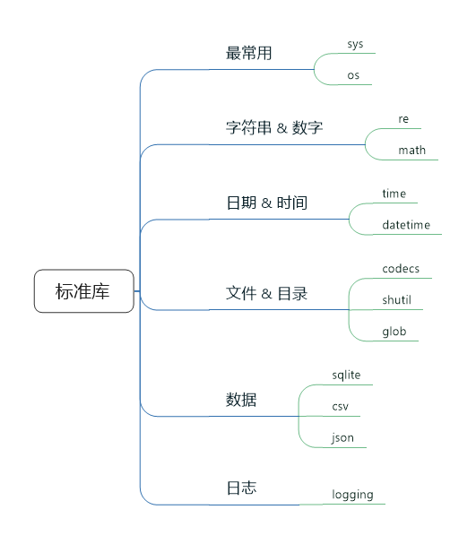
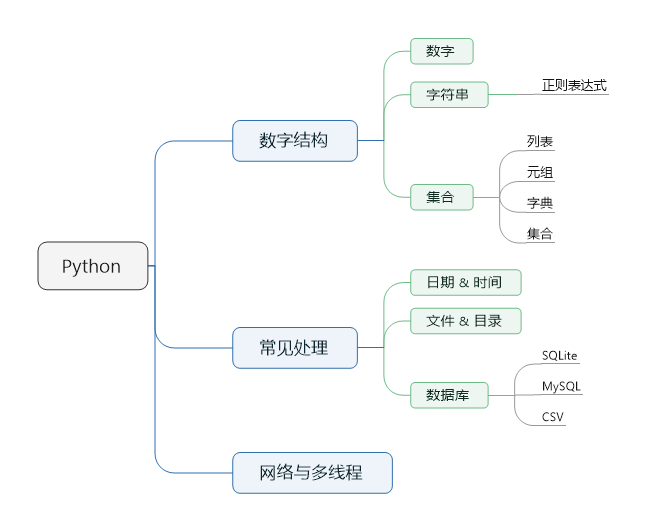

% Python 学习指南

Python,指南

---

#::Copyright

+ 作者 = xiaowang (xer345@126.com)
+ 日期 = 2017-04-11
+ 时间 = 2017-04-11 18:25:48 / 2017-04-20 16:58:39
+ 链接 = [Python 学习指南](http://onlookee.com/?c=Article&a=view&id=7)
+ 版本 = 1.0
+ 关于 = [ONLOOKEE](http://onlookee.com/) 一直在分享有价值软件/应用 、Python经验。

#::文章信息

+ 类别 = Python
+ 平台 = Windows,Mac,Linux
+ 官网 = [Welcome to Python.org](https://www.python.org/ "")

#::截图照片

+ 

#::文章内容

-   [教学材料](#教学材料)
-   [经验之谈](#经验之谈)
-   [运行环境](#运行环境)
    -   [Anaconda](#anaconda)
-   [开发工具 & IDE](#开发工具-ide)
    -   [文本编辑器](#文本编辑器)
    -   [IDE](#ide)
-   [学习路径](#学习路径)
    -   [基础知识](#基础知识)
    -   [常用标准库](#常用标准库)
    -   [正则表达式](#正则表达式)
    -   [编写一些范例](#编写一些范例)
    -   [进阶](#进阶)
    -   [实战](#实战)

作为主流的动态语言，Python不仅简单易学、移植性好，而且拥有强大丰富的库的支持。此外，Python强大的可扩展性，让开发人员既可以非常容易地利用C/C++编写Python的扩展模块，还能将Python嵌入到C/C++程序中，为自己的系统添加动态扩展和动态编程的能力。

Python 的设计哲学之一就是简单易学，体现在两个方面：

-   语法简洁明了：相对 Ruby 和
    Perl，它的语法特性不多不少，大多数都很简单直接，不玩儿玄学。
-   切入点很多：Python
    可以让你可以做很多事情，科学计算和数据分析、爬虫、Web
    网站、游戏、命令行实用工具等等等等，总有一个是你感兴趣并且愿意投入时间的。

教学材料
--------

一些适合初学者入门的教学材料

-   『[Learn Python the Hard Way - Read for
    Free](https://learnpythonthehardway.org/book/)』 - 这本书在讲解
    Python 的语法成分时，还附带大量可实践的例子，非常适合快速起步。
-   『[Python教程 -
    廖雪峰的官方网站](http://www.liaoxuefeng.com/wiki/0014316089557264a6b348958f449949df42a6d3a2e542c000)』
    - 中文教程的翘楚，专为刚刚步入程序世界的小白打造。
-   『[The Hitchhiker’s Guide to Python! — The Hitchhiker’s Guide to
    Python](http://docs.python-guide.org/en/latest/)』 - 这本指南着重于
    Python 的最佳实践，不管你是 Python
    专家还是新手，都能获得极大的帮助。
-   『[Our Documentation | Python.org](https://www.python.org/doc/)』 -
    官方文档，权威指南。
-   『[Python Tutor - Visualize Python, Java, JavaScript, TypeScript,
    Ruby, C, and C++ code execution](http://www.pythontutor.com/)』 -
    一个 Python 对象可视化的项目，用图形辅助你理解 Python 中的各种概念。

经验之谈
--------

本人在学习 Python 的时候，遇到的最大问题就是编码问题，曾一度因此放弃了
Python。

因为是在 Windows
下，因为是中文，然后，经常出现编码异常。然后，就卡在那里了。因为是经常出现，又无从解决，几度差点就放弃
Python 了。

对于编码问题，本人现在有了一个相对完美的解决方案。但是，对于初学者，很可能就会因此而止步。因此，对于初学
Python 的同学，可以先遵循以下几点建议：

-   如果有条件，尽量在 Linux 环境下学习 Python；
-   如果一定要在 Windows
    环境下学习，尽量不要使用中文，以及其他双字节字符；
-   统一使用“utf-8”编码；

运行环境
--------

如果你使用的是 Unix、Linux、MacOS 等操作系统，则多半你的系统已经包含了
Phthon 的基本运行环境，但通常是相对比较旧的版本。如果你使用的是
Windows，则默认是不能运行 Python 程序的。

从某种意义来说，你都需要自己重新建立 Python 的运行环境，这里推荐使用
Anaconda - 一个包含了众多科学计算库的 Python 发行版。Anaconda 支持
Linux、MacOS、Windows，提供了包管理与环境的功能，并且集成了大量优秀的第三方库、科学计算工具等等。

当然，如果你希望从头一步一步学习，加深对 Python
各个功能组件的理解，则用『[官方版本](https://www.python.org/downloads/)』来搭建运行环境是最佳选择。

### Anaconda

对于初学 Python
的同学，任何问题都可能成为拦路虎。为了不至于打击学习的热情，建议还是使用
Anaconda 或类似的集成安装包来搭建运行环境。

Anaconda 有两个不同版本的 Anaconda，分别对应 Python 2.7 和 Python
3.5，两个版本其实除了这点区别外其他都一样。后面我们会看到，安装哪个版本并无本质区别，因为通过环境管理，我们可以很方便地切换运行时的
Python 版本。

安装 Anaconda 时，尽量按照 Anaconda 默认的行为安装——不使用 root
权限，仅为个人安装，安装目录设置在个人主目录下（Windows
就无所谓了）。这样的好处是，同一台机器上的不同用户完全可以安装、配置自己的
Anaconda，不会互相影响。

对于 Mac、Linux 系统，Anaconda
安装好后，实际上就是在主目录下多了个文件夹（\~/anaconda）而已，Windows
会写入注册表。安装时，安装程序会把 bin 目录加入 PATH（Linux/Mac
写入\~/.bashrc，Windows 下则会把 Anaconda 的安装路径添加到系统变量
PATH），这些操作也完全可以自己完成。以 Linux/Mac 为例，安装完成后设置
PATH 的操作如下：

``` {.shell}
# 将 anaconda 的 bin 目录加入 PATH，根据版本不同，也可能是~/anaconda3/bin
echo 'export PATH="~/anaconda2/bin:$PATH"' >> ~/.bashrc
# 更新 bashrc 以立即生效
source ~/.bashrc
```

配置好 PATH
后，可以通过`which conda`或`conda --version`命令检查是否正确。假如安装的是
Python 2.7
对应的版本，运行`python --version`或`python -V`可以得到“Python 2.7.12 ::
Anaconda 4.1.1 (64-bit)”，也说明该发行版默认的环境是 Python 2.7。

开发工具 & IDE
--------------

工欲善其事，必先利其器。

可以使用任何一款文本编辑器来开发 Python，但一款优秀的 IDE
则会极大的提高开发的效率。

推荐使用 PyCharm IDE。

### 文本编辑器

-   [Sublime Text](http://www.sublimetext.com/3)
-   [Atom](https://atom.io/)
-   [Visual Studio Code](https://code.visualstudio.com/Download)

### IDE

-   [PyCharm IDE](https://www.jetbrains.com/pycharm/download/) =
    本人心目中的最佳 Python IDE
-   [Eclipse Downloads](https://www.eclipse.org/downloads/) +
    [PyDev](http://www.pydev.org/) = 如果你习惯了
    Eclipse，这个也是不错的选择
-   [spyder-ide / spyderlib —
    Bitbucket](https://bitbucket.org/spyder-ide/spyderlib/) =
    最大特点是模仿 MATLAB
    的“工作空间”的功能，可以很方便地观察和修改数组的值

学习路径
--------

### 基础知识

-   基本语法
    -   数据结构
        -   数字
        -   字符串
        -   集合
            -   列表
            -   元组
            -   字典
            -   集合
    -   判断语句
    -   循环
    -   列表/字典推导式
    -   函数
    -   模块 & 包
    -   异常

### 常用标准库



标准库

-   最常用
    -   sys
    -   os
-   字符串 & 数字
    -   re
    -   math
-   日期 & 时间
    -   time
    -   datetime
-   文件 & 目录
    -   codecs
    -   shutil
    -   glob
-   数据
    -   sqlite
    -   csv
    -   json
-   日志
    -   logging

### 正则表达式

本人未经证实的发现，编程的时候，多数情况都是在进行字符串的处理。因此，掌握对字符串的各种处理是必备技能。而正则表达式则是处理字符串的法宝。

### 编写一些范例



Python DEMO

-   数字结构
    -   数字
    -   字符串
        -   正则表达式
    -   集合
        -   列表
        -   元组
        -   字典
        -   集合
-   常见处理
    -   日期 & 时间
    -   文件 & 目录
    -   数据库
        -   SQLite
        -   MySQL
        -   CSV
    -   网络与多线程

### 进阶

-   迭代器
-   生成器
-   修饰符
-   with 上下文管理
-   对象关系映射
-   多线程
-   网络

### 实战

Python 可以让你可以做很多事情，科学计算和数据分析、爬虫、Web
网站、游戏、命令行实用工具等等等等，总有一个是你感兴趣并且愿意投入时间的。


#::theEnd