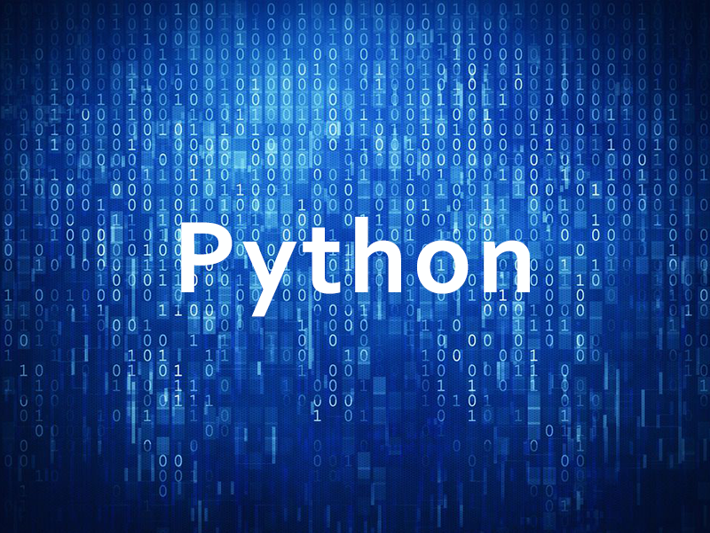

% Python 2.x 编码问题终极解决方案

---

@::id=11
@::htmlname=PythonEncoding
@::pubtime=2017-04-16 23:17:51

#::文章标题

Python 2.x 编码问题终极解决方案

#::文章类别树

Python

#::文章类别表

Python

#::文章标签

Python

#::适用平台

Windows,Mac,Linux

#::截图照片



#::官方网站

[Welcome to Python.org](https://www.python.org/ "")

#::来源网站

[Python 2.x 字符编码终极指南 - Python - 伯乐在线](http://python.jobbole.com/87145/ "")
[Python 编码终极版 - MR.QiGao - 博客园](http://www.cnblogs.com/zhangqigao/p/6490213.html "")
[Python 编码问题之终极解决 - fkissx - 博客园](http://www.cnblogs.com/fkissx/p/5417363.html "")
[26 Python 2.x 字符编码终极指南 - 忧桑的小兔子 - 博客频道 - CSDN.NET](http://blog.csdn.net/lis\_12/54136285 "")
[Python 编码处理-str 与 Unicode 的区别](http://www.mamicode.com/info-detail-308445.html "")
[Python 中的 str 与 unicode 处理方法 - Python - 伯乐在线](http://python.jobbole.com/81244/ "")

#::文章摘要

Python 是一门优美简单、功能强大的动态语言。在刚刚接触这门语言时，我们会被其优美的格式、简洁的语法和无穷无尽的类库所震撼。然而，在真正将 Python 应用到实际的项目中，你会遇到一些无法避免的问题，其中之一就是编码问题。

#::文章内容

-   [重要概念](#重要概念)
-   [开发步骤](#开发步骤)
    -   [1. 使用 utf-8 编码](#使用-utf-8-编码)
    -   [2. 统一使用 unicode](#统一使用-unicode)
    -   [3. Python 编程环境编码](#python-编程环境编码)
    -   [4. 输入输出编码](#输入输出编码)
    -   [5. 利用 chardet 检测编码](#利用-chardet-检测编码)
    -   [6. 利用 codecs 模块进行文件读写](#利用-codecs-模块进行文件读写)
    -   [7. MySQL 使用 utf8 或 utf8mb4
        字符集](#mysql-使用-utf8-或-utf8mb4-字符集)
-   [Python 编码初步认识](#python-编码初步认识)

Python
是一门优美简单、功能强大的动态语言。在刚刚接触这门语言时，我们会被其优美的格式、简洁的语法和无穷无尽的类库所震撼。然而，在真正将
Python
应用到实际的项目中，你会遇到一些无法避免的问题，其中之一就是编码问题。

若是在 Linux 进行开发测试，也许很少会遇到编码问题。但若是在 Windows
下进行开发测试，则遇到编码问题的机率极大。对于使用 Windows
进行开发的同学，很可能因为编码问题而放弃了 Python。即使是使用 Linux
的同学，你也希望你所写的程序是真正跨平台的，那么编码问题也是无法回避的。

重要概念
--------

Python 的字符串有 str 和 unicode 的区别，str 和 unicode 都是 basestring
子类

1.  str 可以看作是 unicode 字符串经过某种编码后的字节组成的数组；
2.  unicode 是真正意义上的字符串；
3.  通过 encode 可以将 unicode 类型编码为 str 类型；
4.  通过 decode 可以将 str 类型解码为 unicode 类型；
5.  Python 会隐式地进行编码、解码，默认采用 ascii；
6.  所有的编码、解码错误都是由于所选的编码、解码方式无法表示某些字符造成的；

开发步骤
--------

> 统一使用 utf-8 编码 统一使用 unicode

### 1. 使用 utf-8 编码

每个文件第一行

``` {.sourceCode .python}
#encoding=utf-8
```

### 2. 统一使用 unicode

在导入其他库之前

``` {.sourceCode .python}
from __future__ import unicode_literals
```

这样，所有非输入（获取）的字符串默认为 unicode 类型。

### 3. Python 编程环境编码

``` {.sourceCode .python}
import sys
reload(sys)
sys.setdefaultencoding('utf8')
```

### 4. 输入输出编码

非英文或多字节字符系统，又非采用 utf-8
编码系统。可使用下面的方式获取输入与输出字符编码。

``` {.sourceCode .python}
print '输入编码 = ', sys.stdin.encoding
print '输出编码 = ', sys.stdout.encoding
```

### 5. 利用 chardet 检测编码

当不清楚字符的编码时，可以使用 chardet 进行编码检测

chardet.detect(str) : 参数只能是 **str** 类型，不能是 unicode 类型

``` {.sourceCode .python}
from chardet.universaldetector import UniversalDetector

'''
检测字符串编码
'''
def detect_encoding(content):
    detector = UniversalDetector()
    contentlist = content.split()
    for line in contentlist:
        detector.feed(line)
        if detector.done:
            break
    detector.close()
    return detector.result['encoding'].lower()

if not isinstance(line, unicode):
    print 'line 的编码 = ', detect_encoding(line)
```

### 6. 利用 codecs 模块进行文件读写

先用 chardet 检测出文件的编码，再利用 codecs 进行文件的读写

由于 chardet
有时候也会无法检测出文件的编码，或者，检测到的编码是错误的，此时可用异常捕获避免程序出错中断

如果 chhardet 无法检测出编码，此时可以进行编码猜测，中文系统：GB18030 \>
GBK \> GB2312 \> ASCII

``` {.sourceCode .python}
#encoding=utf-8
from __future__ import unicode_literals
import chardet
import codecs

'''
检测文件编码
'''
def file_get_encoding(filepath):
    detector = UniversalDetector()
    for line in open(filepath, 'rb'):
        detector.feed(line)
        if detector.done:
            break
    detector.close()
    return detector.result['encoding'].upper()

'''
读文件
'''
def file_get_contents(filepath):
    content = ''
    encoding = file_get_encoding(filepath)
    with codecs.open(filepath, 'r', encoding) as fh:
        content = fh.read()
    # return globals()['convert_to_unicode'](content)
    return content

'''
写文件
'''
def file_put_contents(filepath, content, encoding='utf-8'):
    filepath = os.path.realpath(filepath)
    dirpath  = os.path.dirname(filepath)
    if os.path.exists(dirpath) == False:os.makedirs(dirpath)
    with codecs.open(filepath, 'w', encoding) as fh:
        fh.write(content)

try:
    content = file_get_contents(r'/home/xiaowang/demo.txt')
    file_put_contents(r'/home/xiaowang/demo.txt', '写入测试')
except UnicodeDecodeError as e:
    print e.message
```

### 7. MySQL 使用 utf8 或 utf8mb4 字符集

``` {.sourceCode .python}
try:
    import MySQLdb as mysql
except:
    import pymysql as mysql
conn = mysql.connect(
    host    = '主机地址',
    port    = '端口',
    user    = '用户',
    passwd  = '密码',
    db      = '数据库名',
    charset = 'utf8')
```

Python 编码初步认识
-------------------

``` {.sourceCode .python}
#!/usr/bin/python
# -*- coding: utf-8 -*-   用来指定文件编码为 utf-8 的，如果不指定将会使用系统默认的编码方式
'''windows7 平台下测试'''
'''查看系统的隐式编码方式'''
import locale
print locale.getdefaultlocale()

a = 'Test 测试'
b = u'Test 测试'
'''str 是字节串，隐含了某种编码方式的字节码，由 unicode 经某种编码方式编码而来'''
print a, type(a)             # Test 娴嬭瘯 &lt;type 'str'&gt;
'''这个才是字符串'''
print b, type(b)             # Test 测试 &lt;type 'unicode'&gt;

'''
我们可以将 &lt;type 'unicode'&gt;看作是一系列字符组成的数组，数组的每一项是一个代码点，用来表示相应位置的字符.
所以对于 unicode 来说，其长度等于它包含的字符个数.(unicode 为万国码，也可以理解为中间码)
对 str 来说，其长度等于字节个数
'''
print repr(a)               # 'Test \xe6\xb5\x8b\xe8\xaf\x95'
print repr(b)               # u'Test \u6d4b\u8bd5'，\u6d4b 表示'测'，\u8bd5 表示'试'
print len(a)                # 11
print len(b)                # 7

'''可以将 &lt;type 'str'&gt; 看作是 unicode 字符串经过某种编码后的字节组成的数组.
数组的每一项是一个字节。所以对于 str 字符串来说，其长度等于编码后字节的长度。'''
print a                     # Test 娴嬭瘯
print bytearray(b, 'utf-8')  # Test 娴嬭瘯
print bytearray(b, 'gbk')    # Test 测试
print bytearray(b, 'cp936')  # Test 测试

'''解码，因为 str 类型是隐含有某种编码方式的字节码，此脚本指定为 utf-8，所以用 utf-8 解码'''
t = a.decode('utf-8')
print type(t), t, len(t)      # &lt;type 'unicode'&gt; Test 测试 7
'''编码'''
g = t.encode('utf-8')
print type(g), g, len(g)      # &lt;type 'str'&gt; Test 娴嬭瘯 11
g = t.encode('gbk')
print type(g), g, len(g)      # &lt;type 'str'&gt; Test 测试 9
g = t.encode('cp936')
print type(g), g, len(g)      # &lt;type 'str'&gt; Test 测试 9
'''用 ascii 编码/解码带有中文的 unicode 字符串时，会发生 UnicodeEncodeError/UnicodeDecodeError,
因为 ascii 只包含 127 个字符，无法表示中文.'''
# g = t.encode('ascii')      # UnicodeEncodeError: 'ascii' codec can't encode characters in position 5-6: ordinal not in range(128)
# print type(g), g, len(g)

'''
隐藏的解码
因为 str 类型是隐含有某种编码方式的字节码，所以 Python 内部将其解码为 unicode 后，再和 unicode 类型进行 + 操作，最后返回的结果也是 unicode 类型。
解码过程是在幕后悄悄发生的，默认采用 ascii 来进行解码，Python 之所以采用 ascii，是因为 ascii 是最早的编码方式，是许多编码方式的子集。
'''
try:
    t = u'hello' + 'world'  # helloworld &lt;type 'unicode'&gt;
    print t, type(t)
    print u'hello' + '世界'  # 等价于 u'hello' + '世界'.decode('ascii') ，用 ascii 解码中文会发生错误
except Exception, e:
    print e

'''
隐藏的编码
Python 不只偷偷地用 ascii 来解码 str 类型的字节串，有时还会偷偷用 ascii 来编码 unicode 类型。如果函数或类等对象接收的是 str 类型的字符串，但传进去的是 unicode，Python2 就会使用 ascii 将其编码成 str 类型再做运算。
如果在终端进行输出，则不会抛出异常.因为 Python 会使用控制台的默认编码，而不是 ascii
'''

'''
总结下本文的内容：

str 可以看作是 unicode 字符串经过某种编码后的字节组成的数组
unicode 是真正意义上的字符串
通过 encode 可以将 unicode 类型编码为 str 类型
通过 decode 可以将 str 类型解码为 unicode 类型
Python 会隐式地进行编码、解码，默认采用 ascii
所有的编码、解码错误都是由于所选的编码、解码方式无法表示某些字符造成的
如果你明白了上面每句话的含义，那么应该能解决大部分编、解码引起的问题了。
'''
```


#::下载说明

官方网站：\$(OFFICIAL\_WEBSITE)

软件性质：免费

下载链接：\$(DOWNLOAD\_LINK)


#::下载地址

[slides/pycon2015cn at master · Liuchang0812/slides · GitHub](https://github.com/Liuchang0812/slides/tree/master/pycon2015cn "")

#::theEnd