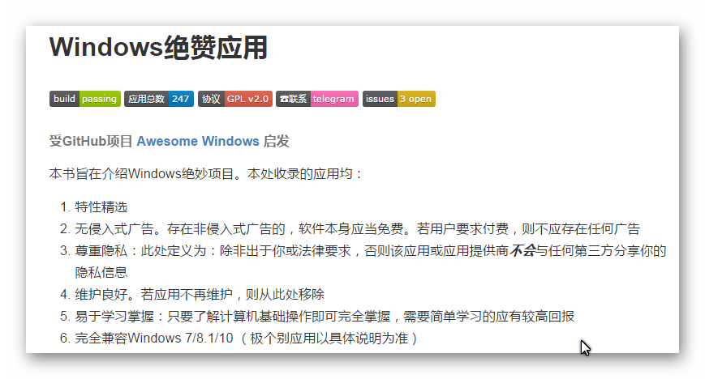

% 绝赞软件 - 推荐列表

绝赞,免费,绿色,合集,大全

---

#::Copyright

+ 作者 = xiaowang (xer345@126.com)
+ 日期 = 2017-04-30
+ 时间 = 2017-04-30 11:25:35 / 2017-05-04 23:13:41
+ 链接 = [绝赞软件 - 推荐列表](http://onlookee.com/?c=Article&a=view&id=13)
+ 版本 = 1.0
+ 关于 = [ONLOOKEE.COM](http://onlookee.com/) 一直在分享有价值的软件/应用 、Python经验。

#::文章信息

+ 类别 = 软件,合集,大全
+ 平台 = Windows
+ 官网 = [GitHub - Windows 绝赞应用](https://github.com/EMLVIRUS/Amazing-Windows-Apps-Zh-CN "")

#::截图照片

+ 

#::文章内容

-   [评选标准](#评选标准)

《Windows 绝赞应用》是 @EMLVIRUS 在 Github 上维护的一个精选 Windows
应用的推荐列表，涉及良心国产、音频文件、即时聊天、压缩处理、美化工具等
20 多个分类的，皆在给用户提供一个更好的软件选择、参考平台。

评选标准
--------

1.  特性精选
2.  无侵入式广告。存在非侵入式广告的，软件本身应当免费。若用户要求付费，则不应存在任何广告
3.  尊重隐私：此处定义为：除非出于你或法律要求，否则该应用或应用提供商***不会***与任何第三方分享你的隐私信息
4.  维护良好。若应用不再维护，则从此处移除
5.  易于学习掌握：只要了解计算机基础操作即可完全掌握，需要简单学习的应有较高回报
6.  完全兼容Windows 7/8.1/10 （极个别应用以具体说明为准）

注意：尽管以下应用可能值得一试，但是不会被列入：

1.  修改版或破解版，例如 无广告版，它们可能体验良好
2.  受地区限制应用，如NPR One、拼音输入法等
3.  仅与32位系统、XP或更旧Windows兼容

很多软件严格来说存在多个合理分类，此处以该软件主要设计目的为准

结尾处列有黑名单，即严重违反尊重隐私与用户利益原则的应用，建议避免使用

[阅读在线版\>\>\>\>](https://www.gitbook.com/read/book/emlvirus/windows-apps-that-amaze-us)\
[阅读在线版\>\>\>\>](https://www.gitbook.com/read/book/emlvirus/windows-apps-that-amaze-us)\
[阅读在线版\>\>\>\>](https://www.gitbook.com/read/book/emlvirus/windows-apps-that-amaze-us)\
 \#\# 标识说明

-   
    可免费使用（可能有收费版功能）
-   
    开源软件
-   
    便携软件或可便携安装：不写入注册表和用户、系统目录，所有配置全写在软件目录下
-   
    具有跨平台版本
-   
    多语言支持：至少支持世界上几种使用较多较广的语言
    -   仅支持单一或者少数语种的以国旗或地区旗帜标注

~~删除线~~：

1.  存在争议的应用，应用信誉尚不确切
2.  长期无更新的应用，不确定维护情况

#::相关下载

[下载地址 = http://onlookee.com/?c=Article&a=download&id=13](http://onlookee.com/?c=Article&a=download&id=13)

#::theEnd