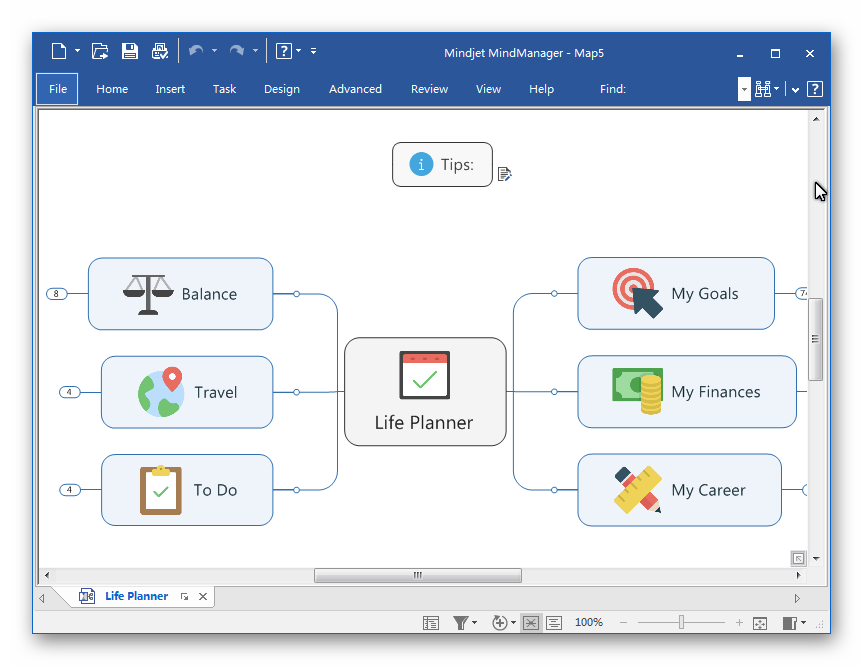

% Mindjet MindManager - 全球领先思维导图解决方案、思维导图神器

---

#::Copyright

+ 作者 = xiaowang (xer345@126.com)
+ 日期 = 2017-04-15
+ 时间 = 2017-04-15 13:07:08 / 2017-04-20 16:58:44
+ 链接 = [Mindjet MindManager - 全球领先思维导图解决方案、思维导图神器](http://onlookee.com/?c=Article&a=view&id=9)
+ 版本 = 1.0
+ 关于 = [ONLOOKEE.COM](http://onlookee.com/) 一直在分享有价值的软件/应用 、Python经验。

#::文章信息

+ 类别 = 软件,思维导图
+ 平台 = Windows
+ 官网 = [MindManager思维导图中文官网-MindManager 2017中文版,思维导图软件下载](http://www.mindmanager.cc/ "")

#::截图照片

+ 

#::文章内容

-   [产品原理](#产品原理)
-   [作用](#作用)
-   [形象思维](#形象思维)
    -   [创建内容丰富的可视化图形](#创建内容丰富的可视化图形)
    -   [同Microsoft Office无缝集成](#同microsoft-office无缝集成)
-   [功能点编辑](#功能点编辑)
-   [主要优势编辑](#主要优势编辑)

MindManager是一款多功能思维导图绘制软件，如同一个虚拟的白板，仅仅通过单一视图组织头脑风暴、捕捉想法、交流规划信息，有其他软件无法媲美的项目管理和商业规划高级功能。

创建进度表、验证需求、设定优先级，从头脑风暴到预算预测，MindManager提供协调项目与避免障碍所需的功能，无论是简单的小项目还是复杂的创作，都可以通过MindManager创建通往成功的蓝图。

产品原理
--------

MindManager有点象拿笔在纸上写、画的技术（当然比这先进多了），它是基于四十多年的对大脑如何在最佳状态下接收和处理信息的研究之上的成果。研究表明大脑的左半球负责处理线性、量性、理性和逻辑性、分析性比较强的事务以及语言表达能力，而右半球则负责处理那些非线性的、直觉的和概念性、整体性、想像性比较强的事务以及非语言能力。研究还表明，当一个信息同时刺激大脑的左右两个半球时，其记忆效果和创新机会将大大提高。其中传统的文本等形式的信息由左半球来处理，而右半球则更好的负责相应的层次结构、空间方位、图标、颜色等信息的处理。

作用
----

Mindjet
MindManager可以将您头脑中形成的思想、策略以及商务信息转换为行动蓝图，令您的团队和组织以一种更加快速、灵活和协调的方式开展工作。它一个可视化的工具，可以用在脑力风暴(brainstorm)和计划(plan)当中。提供给商务人士一个更有效的、电子化的手段来进行捕捉、组织和联系信息(information)和想法(idea)。

形象思维
--------

形象思维的概念产生于人类对自己的大脑是如何工作的深入探索的过程中。形象思维方法通过刺激视觉、触觉和感觉，以达到增进创造力和理解力的目的。MindManager运用形象思维方法，使信息同时刺激大脑两个半球，其编辑界面使得用户可以通过“形象速记法”创建并相互交流各种想法和信息。它设计了一个与人的思考方式一致的自然、直接的工作环境，因此能够减少您所花费的时间、精力，减轻压力，从而提高您的工作效率。它简明、直观、弹性伸缩的界面，合理的流水线式交流沟通方式和特别的创新灵感触发机制，最终对项目管理、产品质量监控、服务质量改进，甚至决策，都起到了很好的促进作用。

### 创建内容丰富的可视化图形

绘制不同思想直接的关系，向重要信息添加编号和颜色以达到突出强调的目的，使用分界线将同类思想分组，插入图标和图片以方便自己和他人浏览大图；提交功能强大的报告：使用MindManager
Presentation模式将您的图形显示给他人，或者将图形内容导出到Microsoft
PowerPoint中，令复杂的思想和信息得到更快的交流。

### 同Microsoft Office无缝集成

同Microsoft软件无缝集成，快速将数据导入或导出到Microsoft Word,
PowerPoint, Excel, Outlook, Project 和 Visio中。

图形共享：可以将您的图形通过Email方式发送给朋友或同事，也可以发布为HTML并张贴到Intranet或Web站点上。

功能点编辑
----------

1.  头脑风暴，聚焦思维，激发创新
2.  会议管理
3.  项目管理
4.  增加模板及主题部件
5.  150多张手绘图画使导图更人性化
6.  自动创建幻灯片功能

主要优势编辑
------------

1.  快速捕捉思想：图形化映射界面易于使用，令您的思想快速文档化；
2.  轻松组织息：通过拖放操作，轻松移动图形内容，令您更快的开发思想，构建更完美的计划；
3.  创建内容丰富的可视化图形：绘制不同思想直接的关系，向重要信息添加编号和颜色以达到突出强调的目的，使用分界线将同类思想分组，插入图标和图片以方便自己和他人浏览大图；
4.  提交功能强大的报告：使用MindManagerPresentation模式将您的图形显示给他人，或者将图形内容导出到Microsoft
    PowerPoint中，令复杂的思想和信息得到更快的交流；同Microsoft
    Office无缝集成：
5.  同Microsoft软件无缝集成，快速将数据导入或导出到Microsoft Word,
    PowerPoint,Excel,Outlook,Project和Visio中。
6.  图形共享：可以将您的图形通过Email方式发送给朋友或同事，也可以发布为HTML并张贴到Intranet或Web站点上。

#::相关下载

[下载地址 = http://onlookee.com/?c=Article&a=download&id=9](http://onlookee.com/?c=Article&a=download&id=9)

#::theEnd