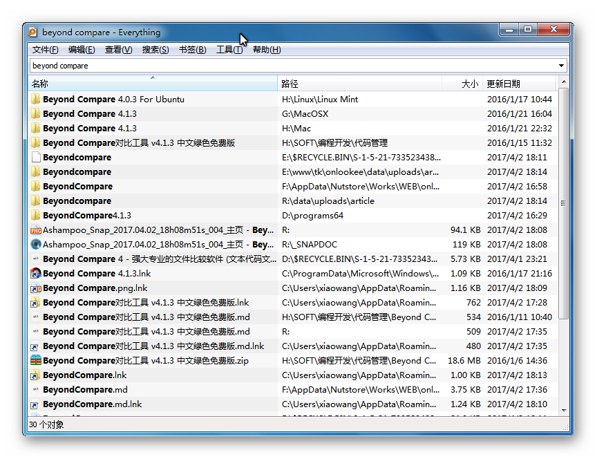

% Everything - 极速文件搜索神器，快得让人震惊

---

@::id=3
@::htmlname=Everything
@::pubtime=2017-02-27 10:33:59

#::文章标题

Everything - 极速文件搜索神器，快得让人震惊

#::文章类别树

软件,文件管理

#::文章类别表

文件管理

#::文章标签

Windows,效率,搜索,文件,文件夹,热键,神器,速度

#::适用平台

Windows

#::截图照片

#::官方网站

[Everything Search Engine](http://www.voidtools.com/ "")

#::来源网站

[Everything 中文绿色版下载 - 免费极速文件搜索工具神器，绝对快得让你震惊！ | 异次元下载说明](http://www.iplaysoft.com/everything.html "")
[Listary作者访谈：自然成长，朴实幸福 – 善用佳软](http://xbeta.info/listary-interview.htm "")

#::文章摘要

Everything 是款简单好用的本地磁盘文件搜索工具。Everything 绿色版是款基于文件、文件夹名称搜索的软件，软件在搜索之前会将搜索的文件和文件夹都列出来，在搜索框输入文字，就能够显示过滤后的文件和目录。

#::文章内容

-   [Everything 常见问题：](#everything-常见问题)
    -   [1. 建立数据库需要多长时间?](#建立数据库需要多长时间)
    -   [2. 能否搜索文件内容?](#能否搜索文件内容)
    -   [3. 是不是非常占用系统资源?](#是不是非常占用系统资源)
    -   [4. 能否监视文件系统更改?](#能否监视文件系统更改)
    -   [5. 如何搜索?](#如何搜索)

Everything 常见问题：
---------------------

### 1. 建立数据库需要多长时间?

搜索只基于文件和文件夹的名称，所以它创建数据库很快。一个刚安装完的Windows
XP SP2系统(约20,000份文件)，需要一秒钟。索引一百万份文件则需要一分钟。

### 2. 能否搜索文件内容?

不，不能搜索文件内容，Everything 搜索只基于文件和文件夹的名称。

### 3. 是不是非常占用系统资源?

不，Everything 使用非常少的系统资源。一个刚安装完的 Windows XP SP2
系统(约 20,000 份文件)需要占用 3-5 mb 内存和不到 1 mb
的硬盘空间。一百万份文件大概需要 45 mb 内存和 5 mb 硬盘空间。

### 4. 能否监视文件系统更改?

是的，Everything
能够监视文件系统改变。文件和文件夹名称的改变会实时地反映到 Everything
数据库。

### 5. 如何搜索?

在搜索框中键入文件或文件夹名称的一部分，结果立刻呈现。

#::下载说明

官方网站：\$(OFFICIAL\_WEBSITE)

软件性质：免费

下载链接：\$(DOWNLOAD\_LINK)

#::下载地址

[官网 - Everything 1.3.4.686 - x86 Portable](http://www.voidtools.com/Everything-1.3.4.686.x86.Multilingual.zip "")
[官网 - Everything 1.3.4.686 - x64 Portable](http://www.voidtools.com/Everything-1.3.4.686.x64.Multilingual.zip "")
[百度云](http://pan.baidu.com/s/1miPrGtM "x0sq")

#::theEnd