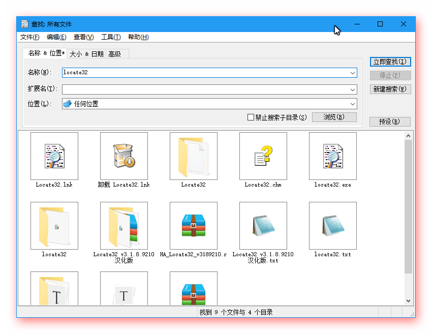

% Locate32 - 极速文件搜索

---

@::id=5
@::htmlname=Locate32
@::pubtime=2017-04-07 22:13:10

#::文章标题

Locate32 - 极速文件搜索

#::文章类别树

软件,文件管理

#::文章类别表

文件管理,文件搜索

#::文章标签

Windows,效率,搜索,文件,文件夹,热键,神器,速度

#::适用平台

Windows

#::截图照片

#::官方网站

[Locate32](http://locate32.cogit.net/ "")

#::来源网站

[[更新]Locate32 – 快速便捷的本地搜索 - 小众软件](http://www.appinn.com/locate32/ "")

#::文章摘要

电脑硬件飞速发展，硬盘越来越大，电脑里的文件以指数级的速度在增长。这个时候我极需这样一款工具，可以快速找到目标文件。

神器 [Everthing](http://onlookee.com/?artitle=locate32) 很好，但是，当需要更多筛选条件的时候， Everything 对于一般用户而言，就显得有点复杂了。

Locate32 绿色版是款基于文件、文件夹名称搜索的软件。

#::文章内容

-   [优点](#优点)
    -   [支持 FAT32](#支持-fat32)
    -   [结果列表支持缩略图](#结果列表支持缩略图)
    -   [更加简单、友好的高级查询条件](#更加简单友好的高级查询条件)
-   [总结](#总结)

电脑硬件飞速发展，硬盘越来越大，电脑里的文件以指数级的速度在增长。这个时候我极需这样一款工具，可以快速找到目标文件。

也许你已经想到了神器 [Everthing](http://onlookee.com/?artitle=locate32)
，不可否认 [Everthing](http://onlookee.com/?artitle=locate32)
的确堪称神器，但是，当需要更多筛选条件的时候， Everything
对于一般用户而言，就显得有点复杂了。如果你需要一款更加简单明了的工具，可试下本文的主角
Locate32。

Locate32 是款基于文件、文件夹名称的极速搜索软件。

优点
----

Locate32 能做的事，基本上 Everything 都能做到，而且多半都做得更好。似乎
Locate32 已经没有存在的必要了。那接下来，就要看看有哪些功能是 Locate32
独有或是做得更好的。

### 支持 FAT32

应该说是不局限于 NTFS 文件系统。如果很不幸，你的文件系统不是
NTFS，此时，Everything 就有些无能为力了。

### 结果列表支持缩略图

Locate32
的结果列表支持缩略图显示。如果你要搜索的文件是图片，则可以直接将结果列表以缩略图的方式进行展现，方便你直接核对结果。

### 更加简单、友好的高级查询条件

Locate32
提供了名称、扩展名、位置、大小、日期、匹配方式、包含文件等多个查询筛选条件。对于搜索某些你已经不太记得的文件时，会相当有用。

相对于 Everything
只有一个查询输入框，要记住各种查询表达式而言，显然要简单、友好得多。

总结
----

Locate32 相对于
Everything，缺点也很明显。需要手动建立索引，不能实时追踪文件的变化，不支持正则表达式，不支持多关键词，不支持可移动磁盘，搜索速度也要慢上一些。

Everthing 很好，但有时候还是会不知所措。这个时候，你就需要 Locate32
来接场了。

如果你要搜索的文件是图片，或者，是你已经不太记得的文件，则可以使用
Locate32 来搜索。

#::下载说明

官方网站：\$(OFFICIAL\_WEBSITE)

软件性质：免费

下载链接：\$(DOWNLOAD\_LINK)

#::下载地址

[官网下载](http://locate32.cogit.net/ "")
[百度云](http://pan.baidu.com/s/1o7Aej94 "4dp9")

#::theEnd