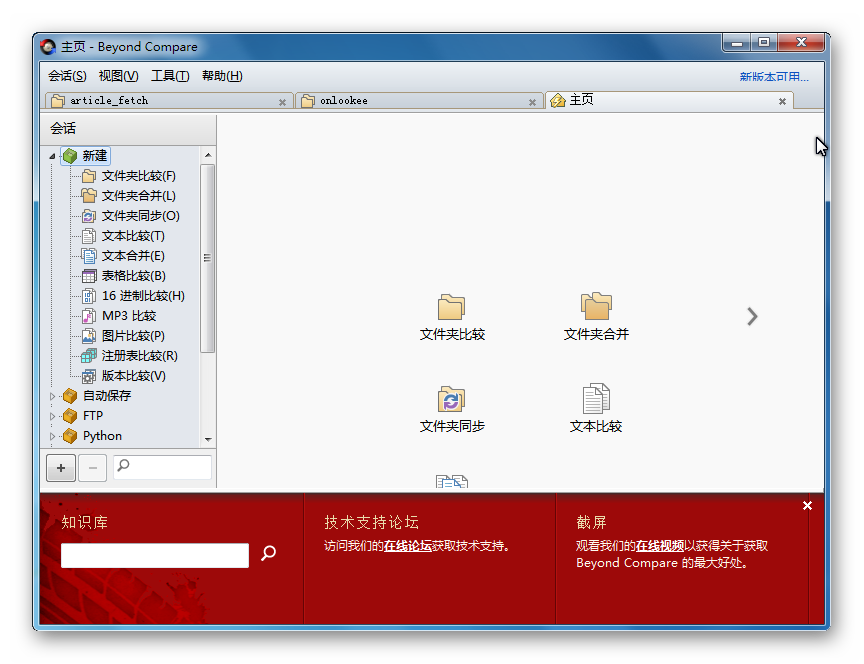
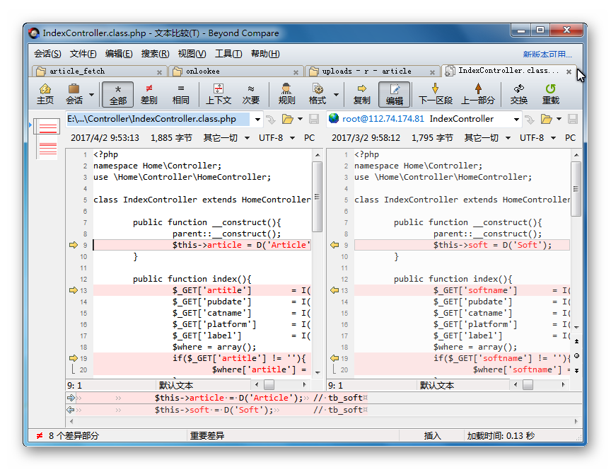
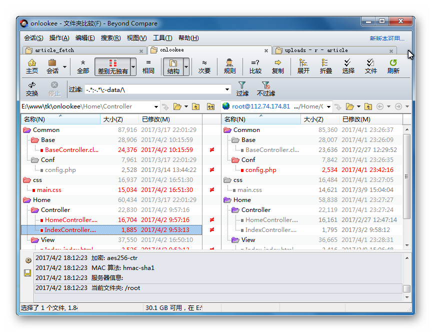

% Beyond Compare 4 - 强大专业的文件比较软件 (文本/代码/文件夹差异对比)

---

#::Copyright

+ 作者 = xiaowang (xer345@126.com)
+ 日期 = 2017-04-02
+ 时间 = 2017-04-02 18:04:05 / 2017-04-20 16:58:46
+ 链接 = [Beyond Compare 4 - 强大专业的文件比较软件 (文本/代码/文件夹差异对比)](http://onlookee.com/?c=Article&a=view&id=4)
+ 版本 = 1.0
+ 关于 = [ONLOOKEE](http://onlookee.com/) 一直在分享有价值软件/应用 、Python经验。

#::文章信息

+ 类别 = 软件,编程开发
+ 平台 = Windows,Mac,Linux
+ 官网 = [Scooter Software: Home of Beyond Compare](http://www.scootersoftware.com/ "")

#::截图照片

+ 

#::文章内容

-   [强大专业高效的文件对比工具](#强大专业高效的文件对比工具)
-   [跨平台+官方绿色版](#跨平台官方绿色版)

我们的文件或者代码经常会有多个副本，当我们很想知道这些副本之间是相同的或是不同的，想知道
TA 们之间有具体有什么差异。

这个时候，我们急需一款工具，可以比较这些文件或者代码，并清晰地显示出 TA
们之间的差异，以便对其进行修改或参考。

Beyond Compare 是一款经典老牌且优秀的**专业级文件比较软件**， TA
可以很方便地对比出两个文件夹或文件之间的不同之处， TA
会把有差异的每一个行或每一个字均用颜色标注出来，你不仅可以直观地查看、定位全部差异点，还能非常方便地修改
TA 们……

强大专业高效的文件对比工具
--------------------------

Beyond Compare
支持普通文本、代码、十六进制文件、注册表、mp3、图片、版本信息、文件夹、压缩包、整个驱动器、FTP网站等进行比较分析。对于**开发者**，你可以用
TA 来对比两份代码的变化；对于文字工作者，可以用 TA
来找出文本哪里被修改过；对于大多数用户，你还能用 TA
来对比文件夹之间的差异，你可以对文件合并、登记快照、或者与FTP服务器进行**同步**。

文件比较

文件夹比较

在进行文件比较的使用界面中，**Beyond
Compare** 提供了全部显示、差异显示、相同行显示、逐段比较、交换两侧等极其方便的按钮，使用文本差异一目了然，显而易见。与其
TA 同类软件相比，Beyond Compare
除了具体以上全面的比较功能外，还附带了文件合并和文件夹同步两种实用工具。

跨平台+官方绿色版
-----------------

Beyond Compare 提供了 Windows、Mac 和 Linux 版三大平台的支持，在 Windows
版中，软件支持便携式（绿色）安装，完全不写系统注册表，你可以把 TA
放到U盘里或者丢到 **云盘** 同步，随时随地进行使用！

#::theEnd