% Sublime Text - 比肩 VIM 兼具 TextMate 的现代文本编辑器

神器,编辑器

---

#::Copyright

+ 作者 = xiaowang (xer345@126.com)
+ 日期 = 2017-04-21
+ 时间 = 2017-04-22 00:35:01 / 2017-05-04 23:13:45
+ 链接 = [Sublime Text - 比肩 VIM 兼具 TextMate 的现代文本编辑器](http://onlookee.com/?c=Article&a=view&id=12)
+ 版本 = 1.0
+ 关于 = [ONLOOKEE.COM](http://onlookee.com/) 一直在分享有价值的软件/应用 、Python经验。

#::文章信息

+ 类别 = 软件,编程开发,文本编辑器
+ 平台 = Windows,Mac,Linux
+ 官网 = [Sublime Text: The text editor you'll fall in love with](http://www.sublimetext.com/ "")

#::截图照片

+ 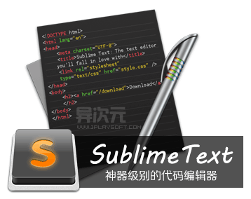

#::文章内容

-   [Sublime Text 特性](#sublime-text-特性)
    -   [语法高亮、代码提示补全、代码折叠、自定义皮肤/配色方案、多便签页](#语法高亮代码提示补全代码折叠自定义皮肤配色方案多便签页)
    -   [代码地图、多种界面布局与全屏免打扰模式](#代码地图多种界面布局与全屏免打扰模式)
    -   [完全开放的用户自定义配置与神奇实用的编辑状态恢复功能](#完全开放的用户自定义配置与神奇实用的编辑状态恢复功能)
    -   [强大的多行选择和多行编辑](#强大的多行选择和多行编辑)
    -   [雷电般快速的文件切换](#雷电般快速的文件切换)
    -   [随心所欲的跳转：快速罗列与定位函数/HTML的元素、跳转到指定行](#随心所欲的跳转快速罗列与定位函数html的元素跳转到指定行)
    -   [集所有功能于一身的命令面板](#集所有功能于一身的命令面板)
    -   [Package Control -
        扩展包管理器](#package-control---扩展包管理器)
    -   [更换主题或配色方案：](#更换主题或配色方案)
-   [一些补充](#一些补充)
-   [写在后面](#写在后面)

一开始碰到 ST 的时候，ST
没有任务多余的元素，灰黑色的界面，还有一个代码地图，感觉酷酷的，就抱着试一试的心情去试一下。

慢慢地，不断的发现 ST 的各种好，已经很接近我理想中的编辑器。

Sublime Text 特性
-----------------

我用过的编辑器不少，但却没有哪款让我特别心仪的，直到我遇到了 『Sublime
Text』。它小巧绿色且速度非常快，跨平台支持
Win/Mac/Linux，支持32与64位，支持各种流行编程语言的语法高亮、代码补全等，并且有很多其他编辑器没有的超酷的特性，让它的好用达到了前所未有的程度……

### 语法高亮、代码提示补全、代码折叠、自定义皮肤/配色方案、多便签页

Sublime Text 支持但不限于 C, C++, C\#, CSS, D, Erlang, HTML, Groovy,
Haskell, HTML, Java, JavaScript, LaTeX, Lisp, Lua, Markdown, Matlab,
OCaml, Perl, PHP, Python, R, Ruby, SQL, TCL, Textile and XML
等主流编程语言的语法高亮。ST 拥有优秀的代码自动完成功能
(自动补齐括号，大括号等配对符号；自动补全已经出现的单词；自动补全函数名)，非常智能；另外
ST
也拥有代码片段（Snippet）的功能，可以将常用的代码片段保存起来，在需要时随时调用。当然，语法高亮、代码折叠、行号显示、自定义皮肤、配色方案等这些已经是一款现代编辑器应有的标配功能了，所以这里就不多做介绍了。

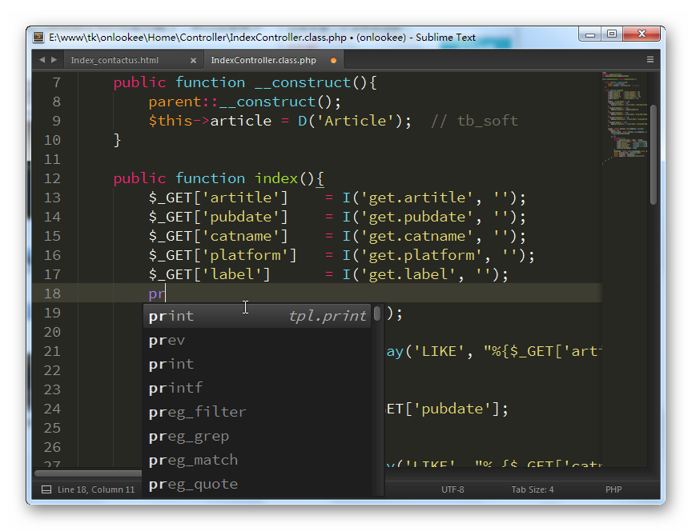

代码提示补全功能

### 代码地图、多种界面布局与全屏免打扰模式

Sublime Text 在界面上比较有特色的是支持多种布局和代码地图，也提供了 F11
和 Shift+F11
进入全屏免打扰模式，文字难描述，看下图吧。往右边拉可以看到更多图 \>\>

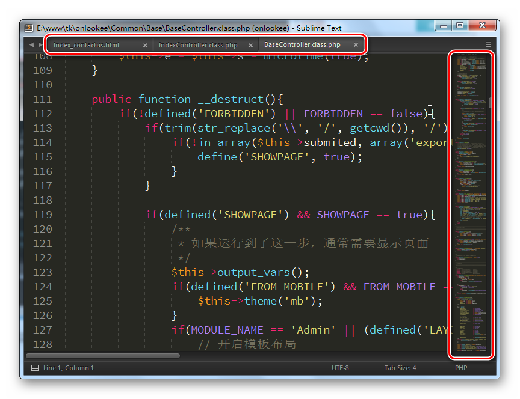

代码地图与多标签页

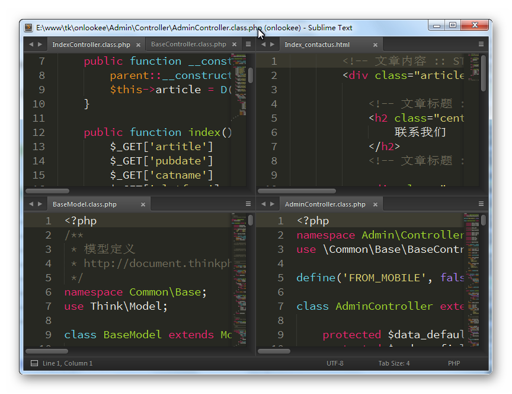

多种布局设置，在大屏幕或需同时编辑多文件时尤为方便

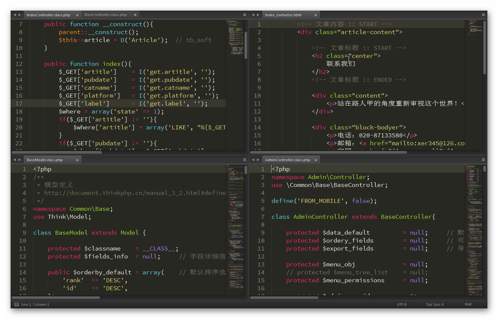

全屏免打扰模式，更加专心于编辑

### 完全开放的用户自定义配置与神奇实用的编辑状态恢复功能

Sublime Text
的各种配置均由配置文件控制，完完全全的可以由用户自定义，如果你愿意折腾，甚至可以将它改得于原版完全不一样的操作体验。看下面的图，『Setting
- Default』
菜单会打开默认的软件配置文件（这个文件会记录一些诸如使用什么字体等很多很多配置信息），『Key
Bindings - Default』
是默认的快捷键配置文件，大家可以打开它们看看原本的一些设置是怎样配置的，但非常**不建议直接在这里修改**！你可以在
『Settings - User』
结尾的文件（也就是用户自定义配置的意思）里面照样画葫芦那样来改，如果两边有相同的项目，它会以
『Settings - User』文件里面定义的为准。

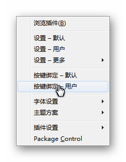

用户自定义配置

这个例子里我在 『Key Bindings - User』
里面的第一行：`{ "keys": ["f12"], "command": "toggle_side_bar" }`,
意思就是按
『F12』时将切换侧边栏显示或隐藏，如果语法神马的没问题，保存好这个文件之后马上就可以使用这个快捷键了。**Sublime
Text
的快捷键还支持双重组合**，譬如默认情况下，将选中的文字改成大写的热键是“Ctrl+K,
Ctrl+U”，意思是当你先按下 Ctrl+K 之后迅速再按 Ctrl+U
进行触发（只按下Ctrl+K是没有作用的），这样可以避免很多热键冲突，也可以更灵活更多选择地进行热键自定义。不过在这里就不打算教大家怎样修改各种配置或修改热键了，这恐怕能出一个手册的，[这里有一个套比较完整的官方文档(鸟语)](http://docs.sublimetext.info/en/latest/index.html)，有兴趣的朋友可以去参考一下。另外，SublimeText 
还有一个值得一提的细节——”编辑状态恢复”，就是当你修改了一个文件，但没有保存，这时退出软件，ST是不会很烦人地提示你要不要保存的，因为无论是用户自发退出还是意外崩溃退出，下次启动软件后，你之前的编辑状态都会被完整恢复，就像你退出前一样。这个细节我认为非常非常的赞！因为我经常会尝试性地去修改一些地方，但在确保没有问题之前又不想保存，这时如果有些事情打断自己，需要离开时，这个特性就很有用了，直接退出就行，不用烦，下次回来打开软件继续编辑即可。当然，有了这个恢复特性再也不怕系统崩溃、断电了吧，真心让人觉得ST特别特别的安全可靠，妥妥的啊！

### 强大的多行选择和多行编辑

在写代码的过程中，我们经常需要同时编辑多行代码或者多个变量。在 ST
中拥有非常实用的多行操作技巧，灵活运用可以大大提高编辑速度哟！相信日后你可能会这样问自己：“**当年没有这种方式的编辑器时我究竟是怎么活过来的？！**”

多行编辑不同于块编辑，下面是一些我所了解的多行编辑方法：

鼠标选中多行，按下 Ctrl+Shift+L (Command+Shift+L) 即可同时编辑这些行；
鼠标选中文本，反复按 CTRL+D (Command+D)
即可继续向下同时选中下一个相同的文本进行同时编辑； 鼠标选中文本，按下
Alt+F3 (Win) 或 Ctrl+Command+G(Mac)
即可一次性选择全部的相同文本进行同时编辑； Shift+鼠标右键 (Win) 或
Option+鼠标左键 (Mac) 或使用鼠标中键可以用鼠标进行竖向多行选择；
Ctrl+鼠标左键(Win) 或 Command+鼠标左键(Mac)
可以手动选择同时要编辑的多处文本类似的技巧还有很多……

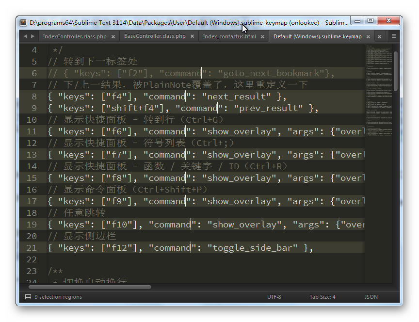

多行编辑

### 雷电般快速的文件切换

如果你同时打开了多个文件，或者你的项目里经常需要编辑不同的文件，在文件数量较多的时候，在过去往往需要花费很多的精力去寻找，很是烦人。而现在，Sublime
Text 里只需按下 Ctrl+P(Win) 或 Shift+Command+P(Mac)
即可调出文件切换面板，接着你只需输入文件名，回车后即可瞬间切换过去！并且它支持模糊匹配，只需输入你记得的一部分即可。

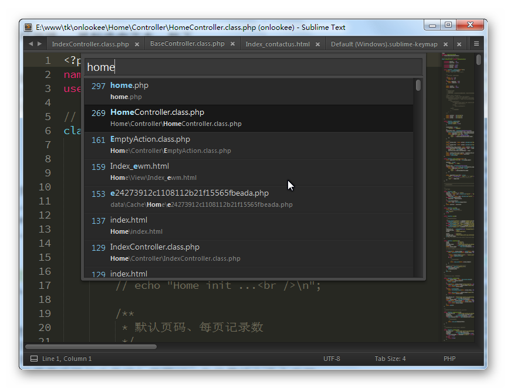

快速切换文件

使用这个功能，你除了可以在已打开的文件中切换之外，如果你使用项目管理（将一个文件夹设置成一个项目），它还能懂得去搜索匹配项目文件夹下未被打开过的文件。现在你还需要用鼠标去一个一个点标签页来切换吗？你还要打开“我的电脑”慢慢在各个不同文件夹去找需要编辑的文件吗？使用ST，你只需输入几个字符即可，前所未有的方便！

### 随心所欲的跳转：快速罗列与定位函数/HTML的元素、跳转到指定行

使用上面介绍的快速文件切换功能，可以很轻易地打开/切换到自己想要编辑的『文档』了，但如果这个文件的代码很长很长，想要轻松跳到要编辑的地方又有什么好方法呢？
Sublime Text 早就帮你想好了，同样是按下前面所说的 Ctrl+P(Win) 或
Shift+Command+P(Mac)，这次试试先输入一个 @
号看看？嗯，好样的！这列表马上帮你罗列出这文件里全部的 Function
了！同样使用模糊匹配，快速输入几个关键字，马上就能定位到那个Function去了！！！在需要不停在多个Function之间跳转的时候这个功能尤显实用～妈妈再也不用担心我找函数找到蛋疼了！当你编辑的是HTML时，这货给你罗列的则是HTML的各个ID元素，相信搞前端的同学们都鸡冻了吧。

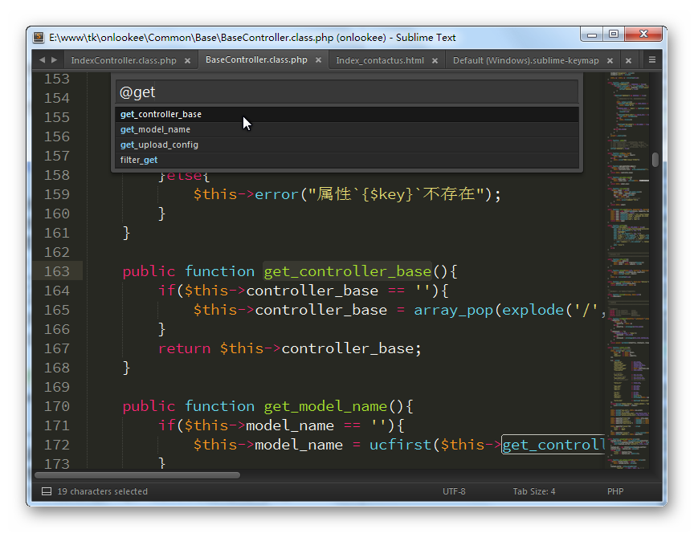

快速罗列与定位函数

Ctrl+P之后输入@号或者**直接按Ctrl+R**，即可列出该文件里的全部function

输入@号开始有此般神奇功效，那么再试试输入一个英文冒号 :
开始吧，然后再输入一个数字，嗯，这次则可以跳到指定的行数了；输入一个\#号开始，可以罗列/搜索文本；而且你还可以使用更快速的快捷键，譬如快速列出/跳转函数就是
Ctrl+R (Mac下是Command+R)，它完全等同于Ctrl+P之后输入@；跳转到指定行号是
Ctrl+G (Mac是Command+G)。

**而且更让人叫绝的是，这些切换定位方法你还可以配合在一起使用**！譬如我有一个名为”hello-iplaysoft.js”的文件，里面其中有一个function叫做”visit\_iplaysoft\_com”，我现在想要编辑这个函数，那么我只需按下
Ctrl+P，然后输入“heip@vi”回车（模糊匹配，注意前面有颜色的字符），ST
马上就给我到打开这个文件并定位进去了！够方便了吧？！熟记这几个快捷键，你可以很一气呵成地进行文件切换和编辑，你会发现世界更美好哦亲……

### 集所有功能于一身的命令面板

Sublime Text
的一大特色是拥有一个相当强大的命令面板，它几乎无所不能！任何时候，按下
Ctrl+Shift+P(Win) 或 Command+Shift+P(Mac)
即可调出。利用它，你可以实现很多很多很多很多很多功能，例如：“Set
Syntax:PHP”即可将当前文档设置成PHP语法高亮；“Convert Case: Swap
Case”可以将选中的文本大小写反转；“File: Save
All”可以一次保存全部文件；“File: Close All”一次关闭全部文件等等……

而且，这里的列表一样支持模糊匹配（这货真心是个好东西啊！）。因为这里面命令实在太多了，覆盖的作用范围也很广，我这里实在不能一一介绍，大家如果有兴趣，可以经常调个面板出来看看列表中都有些什么命令，多多去了解、尝试、再慢慢消化，相信它会让你再也离不开它。

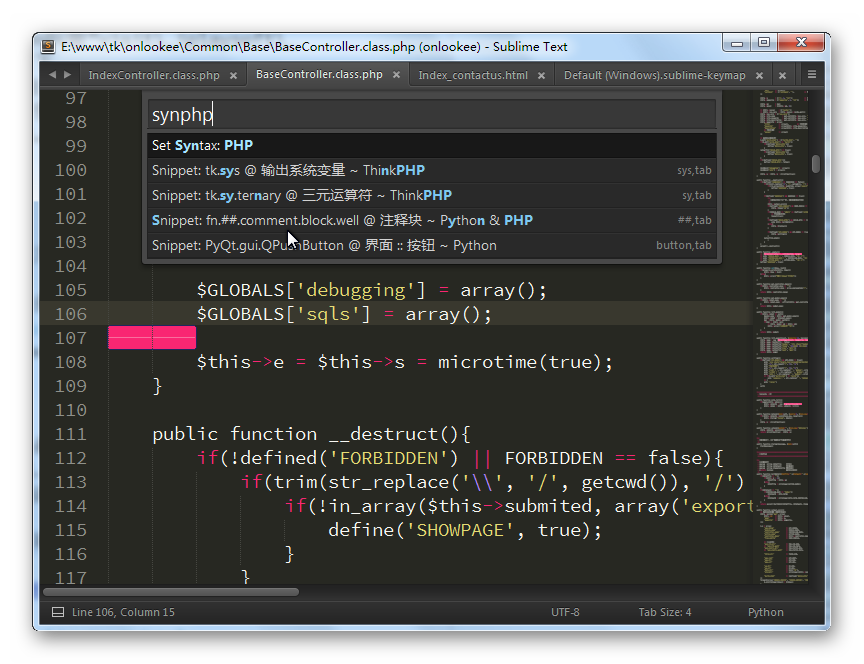

命令面板

### Package Control - 扩展包管理器

ST
除了自身拥有无数实用功能和特性之外，它还能安装使用各种扩展/皮肤/配色方案等来增强自己。现在介绍的这个
『Package Control』
可以看做是一个ST的扩展管理器，使用它，你可以用非常神奇、非常简单方便的方法去下载、安装、删除
Sublime Text 的各种插件、皮肤等，相信我，想更好地使用 ST
绝对不能没有它！

不过 ST 本身并没有自带这个工具，我们需要自行安装它，方法很简单：

1.  在 Sublime Text 的目录里面找到 Data \> Installed Packages 的文件夹
    (如没有请手动新建)
2.  在这里下载 [Package
    Control.sublime-package](http://dl.iplaysoft.com/files/1774.html)
    文件
3.  将下载到的文件放进去 Installed Packages 里面
4.  重新启动 Sublime Text

即可如果 Package Control 已经安装成功，那么 Ctrl+Shift+P
调用命令面板，我们就会找到一些以“Package
Control:”开头的命令，我们常用到的就是几个 Install Package
(安装扩展)、List Packages (列出全部扩展)、Remove Package
(移除扩展)、Upgrade Package
(升级扩展)。但如果你按照上面的方法确实搞不定，可以试试按键盘 Ctrl+\~
（数字1左边的按键）调出控制台，然后拷贝下面的代码进去并回车，它会自动帮你新建文件夹并下载文件的，与上面的方法最终效果是一样的：

``` {.sourceCode .python}
# Sulime Text 2
import urllib2,os,hashlib; h = 'df21e130d211cfc94d9b0905775a7c0f' + '1e3d39e33b79698005270310898eea76'; pf = 'Package Control.sublime-package'; ipp = sublime.installed_packages_path(); os.makedirs( ipp ) if not os.path.exists(ipp) else None; urllib2.install_opener( urllib2.build_opener( urllib2.ProxyHandler()) ); by = urllib2.urlopen( 'http://packagecontrol.io/' + pf.replace(' ', '%20')).read(); dh = hashlib.sha256(by).hexdigest(); open( os.path.join( ipp, pf), 'wb' ).write(by) if dh == h else None; print('Error validating download (got %s instead of %s), please try manual install' % (dh, h) if dh != h else 'Please restart Sublime Text to finish installation')
```

``` {.sourceCode .python}
# Sulime Text 3
import urllib.request,os,hashlib; h = 'df21e130d211cfc94d9b0905775a7c0f' + '1e3d39e33b79698005270310898eea76'; pf = 'Package Control.sublime-package'; ipp = sublime.installed_packages_path(); urllib.request.install_opener( urllib.request.build_opener( urllib.request.ProxyHandler()) ); by = urllib.request.urlopen( 'http://packagecontrol.io/' + pf.replace(' ', '%20')).read(); dh = hashlib.sha256(by).hexdigest(); print('Error validating download (got %s instead of %s), please try manual install' % (dh, h)) if dh != h else open(os.path.join( ipp, pf), 'wb' ).write(by)
```

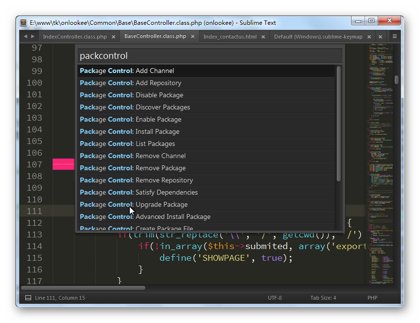

Package Control

在命令面板输入 “Package Control: Install
Package“即会列出全部可以安装的扩展（必需连接网络，如下图），从列表可以看到，4GL、AAAPackageDev
那些就是插件的名称，选择它们就可以进行下载安装了。从该列表可以看到，目前ST的各种扩展已经非常丰富了！此外，你还可以在[Package
Control - the Sublime Text package
manager](https://packagecontrol.io/)这里看到 Web
版的扩展列表和详细的说明。

当然，不同的扩展，使用的方法与表现的形式都不一样，这个就只能去web版查一下这个插件的一些具体的使用说明了，这里是不能一概而论的。不过大体上，安装和使用插件就是这么的简单。通过各种插件，你几乎可以实现任何你想要的功能。而且
ST
也开放了插件API，如果你有能力，也可以试试开发一个，可以[参考这里的API文档](http://www.sublimetext.com/docs/2/api_reference.html)。本文后面会推荐一些实用的插件。

### 更换主题或配色方案：

如果你看腻了 SublimeText
的原版皮肤，也可以折腾一下换肤的。譬如下图是一款比较流行的主题 Theme -
Soda，和安装插件基本上一样，使用 Package Control 进入 Install Package
的列表里面找到它进行安装即可。你也可以在网上找到一些 ST
的主题，下载回来放到安装目录的 Data\\Packages
文件夹里面，然后选择切换主题。配色方案的操作也是类似，大家自己研究研究吧，这里不多做介绍了。

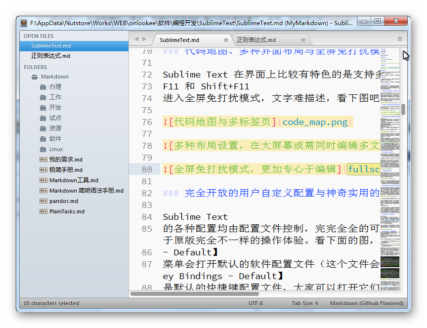

Soda主题

另外，SublimeText 还有很给力的一点，就是它能原生支持 TextMate 的 Bundle
和配色方案，同样也是放在 Packages 文件夹里即可使用。TextMate 的 Bundle
和配色方案资源都比较丰富，网上可以找到不少。

一些补充
--------

因为 SublimeText
是绿色软件，用户的自定义配置、下载的插件等都是位于软件目录内的，所以一旦你配置好之后，使用『同步网盘』进行同步（无网络的朋友用『U盘』也行），去到哪里运行都是自己的配置，非常方便！以后大家在不同的电脑上工作相信也能很顺手了。

另外，很多朋友反映表示打开中文会有乱码，其实是因为ST本身只支持UTF-8编码，而我们常遇到的中文文件可能是GBK或者GB2312等编码，解决方法是安装一个 ConvertToUTF8
或者 GBK Encoding Support 插件即可完美解决，这个并不是什么大问题。

写在后面
--------

从各种使用体验来说，ST 给人最多的感觉就是“快”和“流畅”。“快”就像『Chrome
浏览器』与其他一般浏览器的比那样，启动速度让人非常满意；“流畅”就是当你熟悉了它的一些快捷操作之后，编辑文档时那种不需打乱思绪的行云流水般的操作，非常让人有成就感！作为一款功能、扩展性如此强大，可配置性如此自由的软件，能做到速度如此之快实属极致了，想想看那些大型笨重的IDE们吧，你就恨不得马上去告诉所有人世界上还有
SublimeText 这样的神器～

Sublime Text 比 TextMate
在跨平台和软件更新上有很大优势，比另一款同样是神器级别的编辑器 VIM
入门又简单得多，比各大IDE又要轻巧快速，比网上大部分的编辑器功能和扩展性上要强，而且暗色系的界面也很酷很讨好人，可以说是目前除
VIM、emacs
外又一个代码编辑器的最佳选择了！（更现代更先进的界面比VIM更适合普通用户）


#::相关下载

[下载地址 = http://onlookee.com/?c=Article&a=download&id=12](http://onlookee.com/?c=Article&a=download&id=12)

#::theEnd